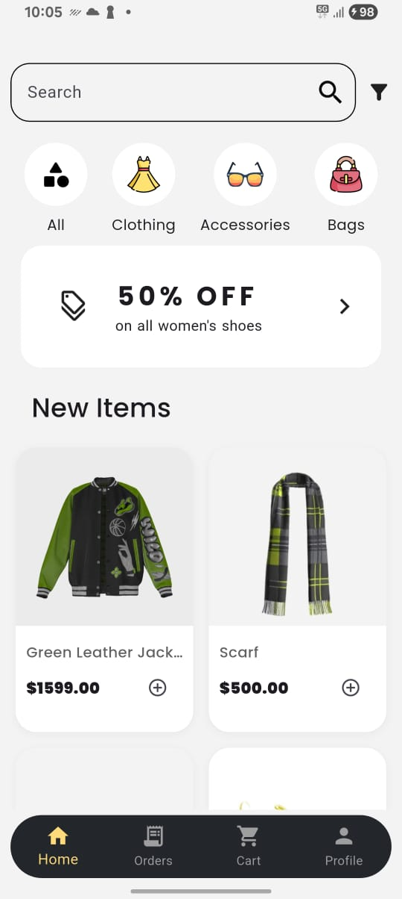
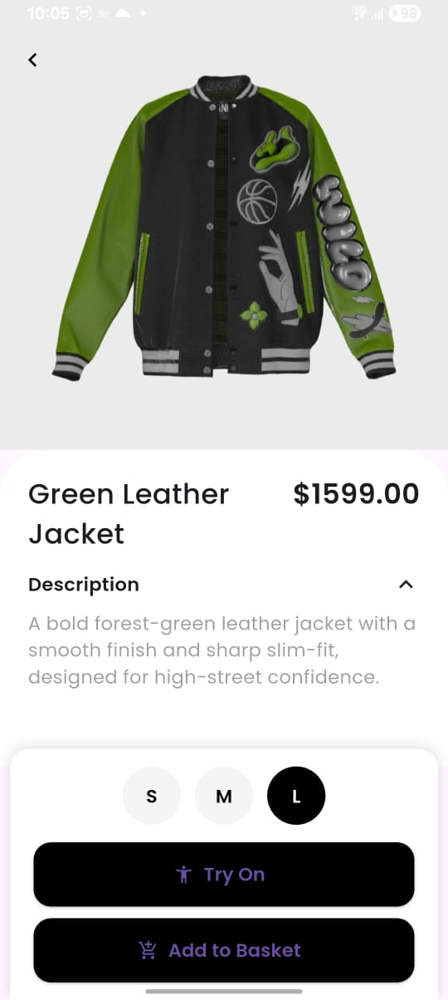
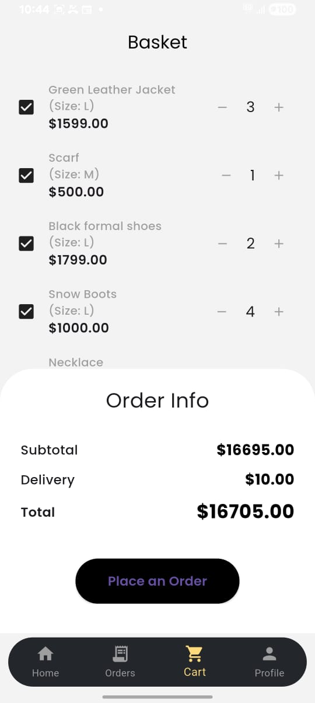

# 👗 TryOn — AR Virtual Outfit Experience

**"See it. Style it. Own it."**

TryOn redefines digital fashion with an **Augmented Reality (AR) Try-On experience** that lets users visualize how clothes, shoes, and accessories look on them instantly and interactively. Built with **Flutter**, TryOn combines high-performance UI, precise tracking, and realistic rendering to bring the dressing room to your device.

---

## 🚀 Features

* **👕 Real-Time AR Try-On** – Virtually wear clothes, shoes, and watches with accurate fitting and natural movement.
* **🪄 Smart Body Tracking** – Auto-detects body and limb motion for seamless alignment with virtual items.
* **🎨 Outfit Preview** – Mix and match styles in real time.
* **🛒 Integrated Storefront** – Browse, select, and add items directly to your cart.
  
---

## 🧩 Tech Stack

* **Frontend:** Flutter (Dart)
* **Backend:**   Node.js
 

---

## 📱 Screenshots

| Home Screen                          | Outfit Preview                             | Style Switch                           |
| ------------------------------------ | ------------------------------------------ | -------------------------------------- |
|  |  |  |

---

## 🎥 Demo

<video src="https://github.com/user-attachments/assets/b0cc6ded-4f5a-45db-80fd-022325caeb9d" controls width="600"></video>

---

## 📄 Presentation

[Download Presentation](assets/docs/TRYON.pptx)

---

## ⚙️ Setup Instructions

1. **Clone the repository:**

   ```bash
   git clone https://github.com/yourusername/tryon.git
   cd tryon
   ```

2. **Install dependencies:**

   ```bash
   flutter pub get
   ```

3. **Go to root of project:**

   ```bash
   cd frontend/tryon
   ```
   
4. **Run the app:**

   ```bash
   flutter run
   ```

---

## 🧠 Future Enhancements

* Enhanced 3D clothing physics simulation
* AI-powered size and fit prediction
* Multi-person try-on support

---

